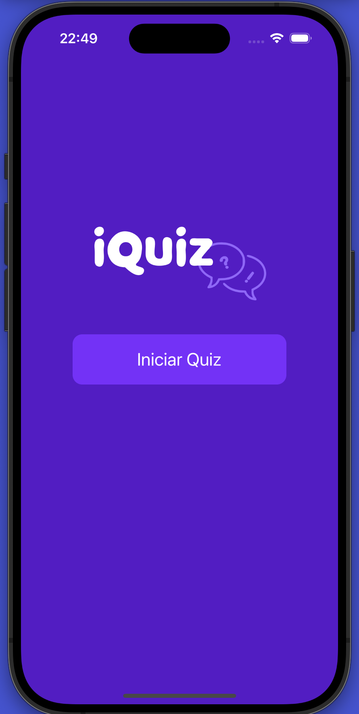
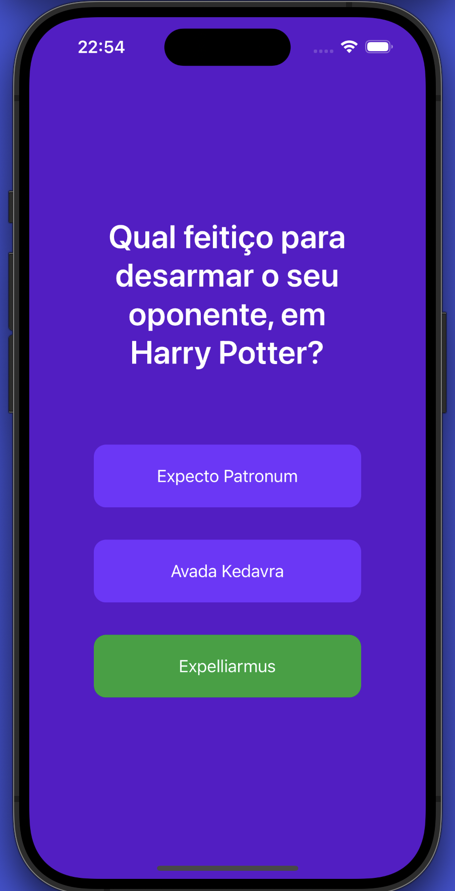
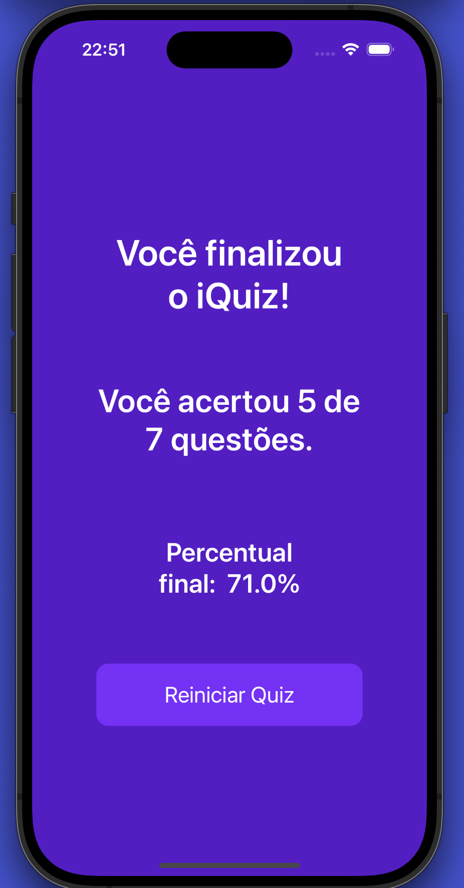

# iQuiz - IOS App
<h1 align="center"> 
 iQuiz
</h1>

<p align="center">
	Esse projeto consiste em um aplicativo simples de perguntas e respostas feito com UIKit
</p>

<p align="center">
  <a href="#-Tecnologias">Tecnologias</a>&nbsp;&nbsp;&nbsp;|&nbsp;&nbsp;&nbsp;
  <a href="#-Executando">Executando</a> 
</p>

### ✨ Apresentação:
---

<p align="center">
  

  

  
</p>

---

### 🧪 Tecnologias


### 🚀 Executando

Clone o projeto e abra o projeto no XCode

```bash
$ git clone git@github.com:lucasDechenier/iQuiz.git
```

Build e inicie no XCode
&nbsp;


<a href="https://github.com/lucasDechenier">
 
 <br />
 <sub><b>Lucas Dechenier</b></sub></a> <a href="https://github.com/lucasDechenier" title="Rocketseat">🚀</a>

Feito com ❤️ por Lucas Dechenier 👋🏽 Entre em contato!

[](https://www.linkedin.com/in/lucas-dechenier-14821a175/) 
[](mailto:lucas.dechenieroliveira@gmail.com)